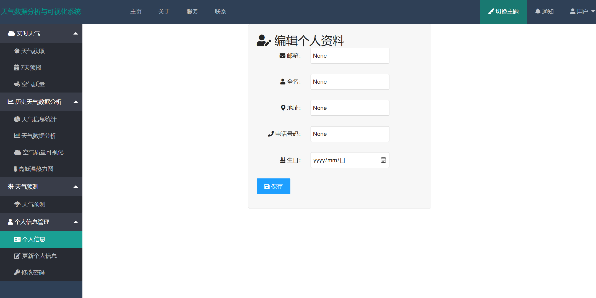
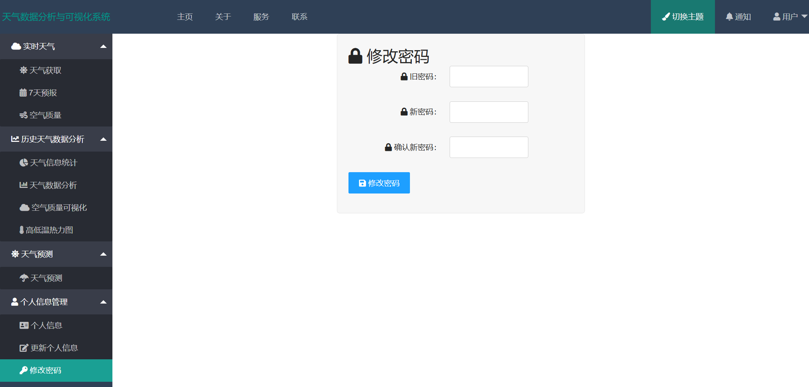

# **天气数据分析与预测可视化系统**

Python基于Flask的天气数据分析与预测可视乎系统。使用Mysql数据库，以及经典layui框架，并且使用BeautifulSoup等爬虫技术，echarts可视化、百度地图api，预测部分使用线性回归算法以及LSTM算法。最后构成了一个具有登录注册，可以进行实时天气获取、查看7天天气预报以及实时空气质量，在历史数据分析方面进行天气类型统计，以及全国主要城市天气数据基本分析例如柱状图，折线图，饼图等并对每天的历史空气质量进行可视化，以及对历史数据每天最高温最低温的可视化地图。预测方面对未来7天最高温最低温进行预测。还提供了个人信息管理，以及管理员功能后台管理，包括天气数据的增删改查与用户信息的增删改查。最后通知管理，管理员可以向所有用户发送邮箱信息，还可以发布系统通知，管理系统通知。
## **登录与注册**

## 1.实时天气

### 天气获取

### 7天预报

### 空气质量

## **2.历史天气数据分析**

### 天气信息统计

### 天气数据分析

### 空气质量可视化

### 高低温热力图

# **3.天气预测**

## 线性回归与LSTM算法

# **4.个人信息管理**

## 个人信息

## 更新个人信息

## 修改密码

# **5.后台管理（仅限管理员）**

## 天气数据管理

## 用户信息管理

# **6.通知管理（仅限管理员）**

## 邮件通知

## 公告通知

## 公告管理

# **# 7.通知**

# **8.关于**

# **9.服务**

# **10.联系我**
